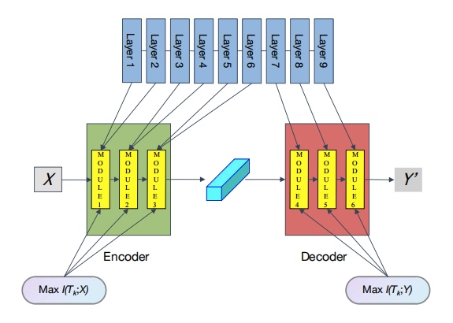

# MOLE: MOdule Learning FramEwork via Mutual Information Maximization
Here display the part of results with good performance.
<p align="center">


## BibTeX Citation
```
@inproceedings{li2023mole,
  title={MOLE: MOdular Learning FramEwork via Mutual Information Maximization},
  author={Li, Tianchao and Pei, Yulong},
  booktitle={ICML Workshop on Localized Learning (LLW)},
  year={2023}
}
```
